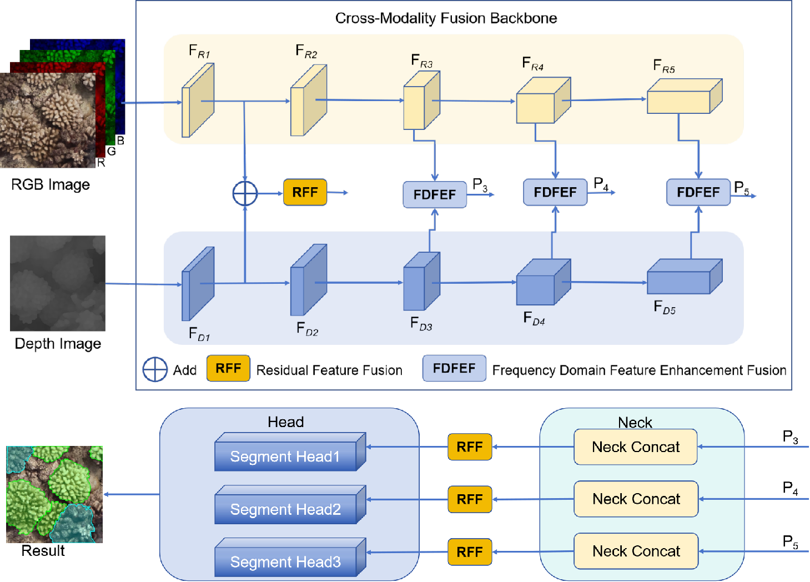
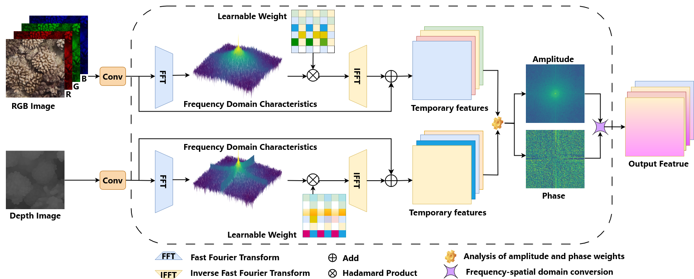
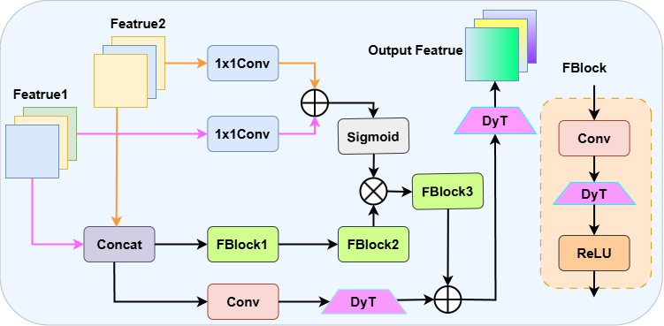
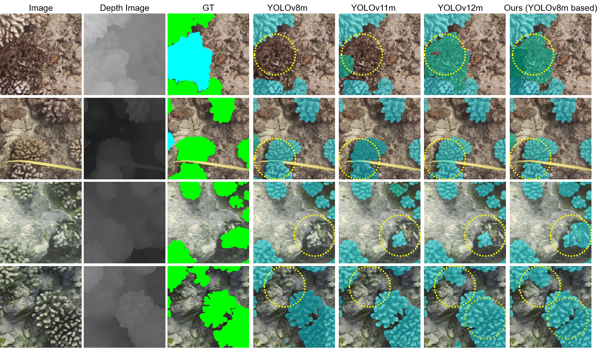
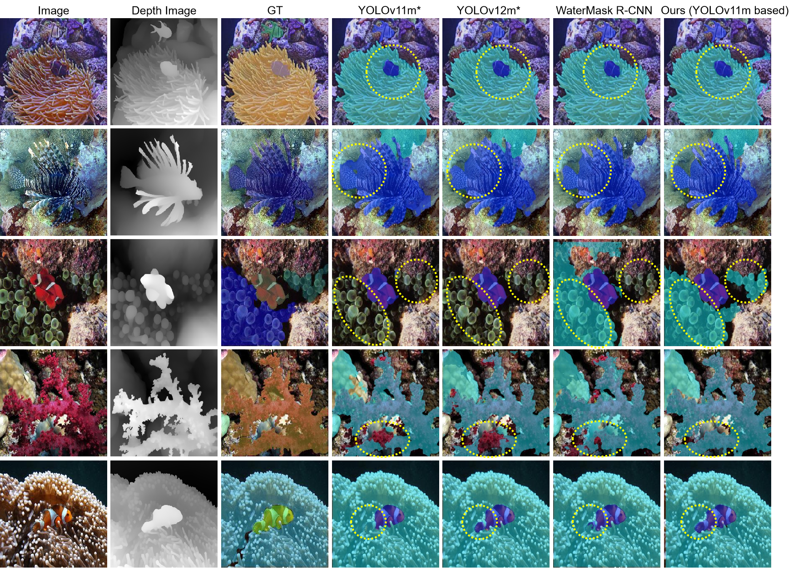

# <div style="text-align: center;">UMIS-YOLO: Underwater Multimodal Images Instance Segmentation with YOLO</div>


## Introduction 

We presents a novel multimodal instance segmentation method, termed UMIS-YOLO, which is grounded in the YOLO architecture. UMIS-YOLO incorporates a dual backbone network design that substantially enhances the feature extraction capabilities for both RGB images and depth images, thereby improving the effectiveness of instance segmentation. At the same time, we propose two innovative plug-and-play modules: the frequency-domain feature enhancement fusion (FDFEF) module and the residual feature fusion (RFF) module. The FDFEF module leverages Fourier transform to enhance the features of both modalities in the frequency domain, using learnable weights to enable the complementary integration of amplitude and phase information. While the RFF module uses a residual learning strategy to efficiently merge low-level and high-level features prior to the segmentation head, thereby improving pixel-level segmentation accuracy. 

In addition, we introduce a challenging high-resolution dataset, UMIS-Coral, which comprises RGB images and depth images captured in complex coral environments. Meanwhile, we expand the depth images for the UIIS dataset to further verify the effectiveness of UMIS-YOLO. 

## Document
### Recommended Environment

- [x] torch 2.7.0
- [x] torchvision 0.22.0
- [x] numpy 1.26.3
......

You only need to install the corresponding libraries to refer to train.by and val.by for training and validation.


## Dataset
Like [UMIS-Coral.yaml](./UMIS-Coral.yaml) and [UIIS-Depth.yaml](./UIIS-Depth.yaml) You can use your own dataset.

<details open>
  <summary><b>File structure</b></summary>

```
Your dataset
├── ...
├── train
|   ├── rgb
|   |   ├── images
|   |   ├── labels
|   ├── depth
|   |   ├── images
|   |   ├── labels
└── val
|   ├── rgb
|   |   ├── images
|   |   ├── labels
|   ├── depth
|   |   ├── images
|   |   ├── labels
```

</details>

You can download the datasets using the following link:
- [UMIS-Coral](https://pan.baidu.com/s/1vaN8dDm7PiPvmimFUSPS9A) (password: tdvb)

- [UIIS-Depth](https://pan.baidu.com/s/1Bjjw9ynVoJrP_VuoEe1ttQ) (password: bqvg)

## Pipeline
### The framework
<div align="center">
  
</div>

 The overall framework of UMIS-YOLO adopts a dual backbone network architecture that is compatible with YOLO
architecture. FDFEF and RFF modules are introduced to better integrate the features of RGB images and depth images, thereby
enhancing the performance of underwater instance segmentation

### FDFEF
<div align="center">
  
</div>

The FDFEF module initially enhances the features of RGB and depth images independently within
the frequency domain, subsequently integrating these features through a fusion of amplitude and phase components.

### RFF
<div align="center">
  
</div>

The RFF module adeptly integrates the P1-level features extracted from the backbone network with
the features preceding the segmentation head.

## Visual comparison
### UMIS-Coral
<div align="center">
  
</div>

### UIIS-Depth
<div align="center">
  
</div>

 
 Trained Weights：
 - [UMIS-Coral](weights/UMIS-Coral.pt)
 - [UIIS-Depth](weights/UIIS-Depth.pt)


## Citation
If you use this code or ideas from the paper for your research, please cite our paper:
```

@article{yang2025umis,
  title={UMIS-YOLO: Underwater Multimodal Images Instance Segmentation with YOLO},
  author={Yang, Yue and Feng, Xiaoyi and Li, Ming and Hu, Xiangyun and Qin, Jiangying and Gruen, Armin and Li, Deren and Gong, Jianya},
  journal={IEEE Transactions on Geoscience and Remote Sensing},
  year={2025},
  publisher={IEEE}
}
```

## Acknowledgement
Part of the code is adapted from Ultralytics: [Ultralytics](https://github.com/ultralytics/ultralytics). We thank all the authors for their contributions.
